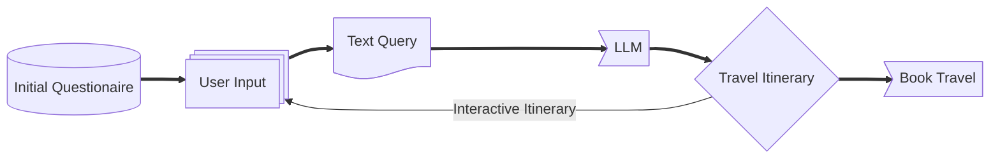

# Travel Itinerary Generator
travel_planner/
├── app.py
├── templates/
│   └── index.html
├── requirements.txt
└── data/
    └── example.csv  # Optional starter CSV

## Overview
The Travel Itinerary Generator is a web-based application that automates the process of creating a personalized travel itinerary for a group based on multiple user inputs. It collects travel details via a Google Form, processes the data, and generates a shared itinerary using OpenAI's ChatGPT API while incorporating location preferences, travel distance limits, preferred travel types, and budget constraints.
stateDiagram-v2




## Features
- **Google Forms Integration**: Automatically fetch travel details submitted through a Google Form.
- **AI-Powered Itinerary Generation**: Uses ChatGPT to generate a structured and detailed group itinerary based on user preferences.
- **Aggregated User Inputs**: Combines multiple user submissions to create a single itinerary suitable for all travelers.
- **Customizable Output**: Users can modify and adjust the generated itinerary.
- **Budget Considerations**: Takes into account various budget levels and provides recommendations accordingly.
- **Export Options**: Download the itinerary in PDF, Markdown, or plain text formats.
- **User-Friendly Interface**: Simple and intuitive UI for accessing and reviewing itineraries.

## Tech Stack
- **Backend**: Python (Flask or FastAPI)
- **Frontend**: React (or a minimal HTML/CSS/JavaScript UI)
- **Database**: Firebase / Google Sheets API (for storing form responses)
- **APIs**:
  - Google Forms API (or Google Sheets API) to fetch user responses
  - OpenAI ChatGPT API for itinerary generation
  - Google Maps API for location-based suggestions

## Installation & Setup
### Prerequisites
- Python 3.x
- Node.js & npm (if using React for frontend)
- API keys for OpenAI, Google Forms, and Google Maps

### Steps
1. **Clone the repository**
   ```sh
   git clone https://github.com/pjbrumm94/TravelApp.git
   cd TravelApp 
   ```
2. **Set up a virtual environment**
   ```sh
   python -m venv venv
   source venv/bin/activate  # On Windows: venv\Scripts\activate
   ```
3. **Install dependencies**
   ```sh
   pip install -r requirements.txt
   ```
4. **Configure API keys**
   - Create a `.env` file and add the necessary API keys:
   ```env
   OPENAI_API_KEY=your_openai_api_key
   GOOGLE_SHEETS_API_KEY=your_google_sheets_api_key
   GOOGLE_MAPS_API_KEY=your_google_maps_api_key
   ```
5. **Run the backend server**
   ```sh
   python app.py
   ```
6. **(Optional) Set up frontend**
   ```sh
   cd frontend
   npm install
   npm start
   ```

## Usage
1. Share the Google Form with users to collect travel details.
2. The application retrieves form responses and aggregates user preferences.
3. A personalized group itinerary is generated based on the most common travel type, a suitable destination within the group’s distance range, and a preferred budget level.
4. Users can download or further customize the itinerary.

## Future Enhancements
- User authentication and itinerary storage
- Multi-language support
- Integration with airline and hotel APIs for real-time bookings
- Collaborative trip planning features allowing user voting
- Enhanced activity filtering based on fitness levels and interests

## Contributing
Contributions are welcome! Feel free to fork the repository, make improvements, and submit a pull request.


